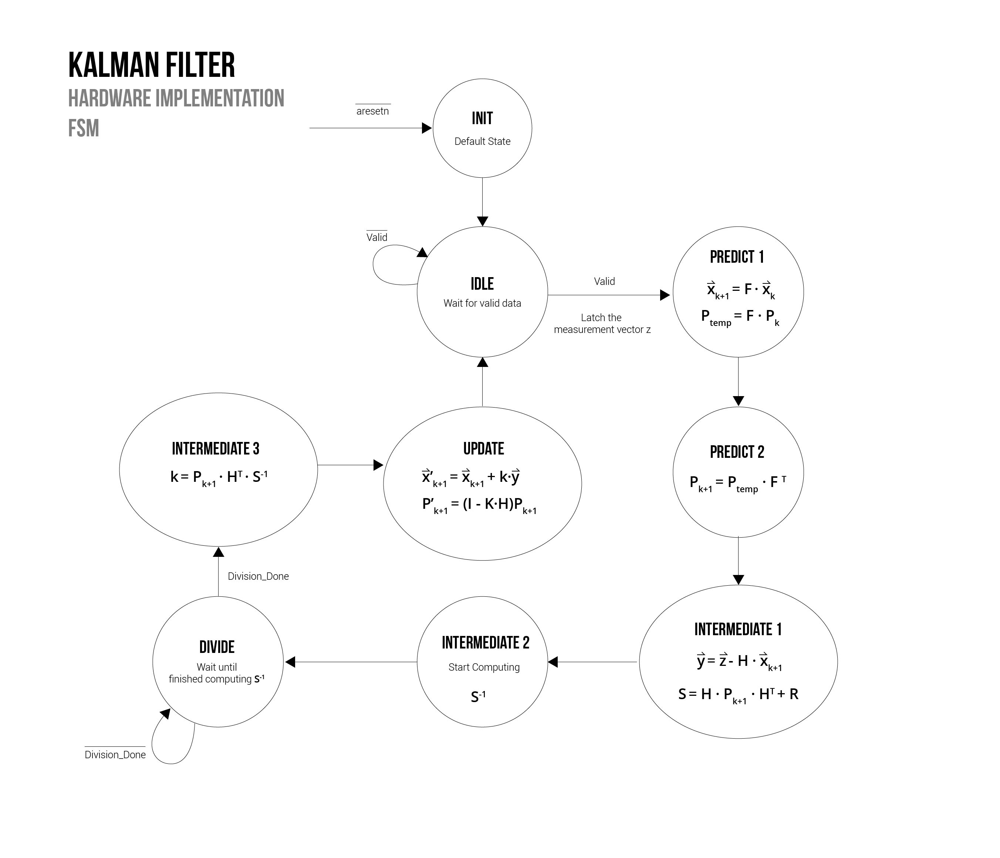
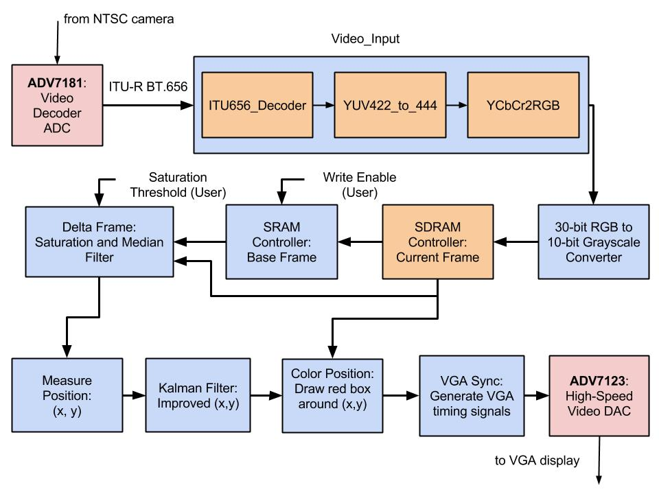

# Implementing the Kalman Filter Equations in Hardware
### Overview
The goal of this experiment is to implement the `sw/applyKalman.m` software in hardware. This software essentially just applys the Kalman filter equations outlined in `doc/kalman_notes.pdf` to the measured position in order to produce an improved position. The challenges with this implementation are:

1. Only some equations can be done in parallel, some must be done in series. This means this pipeline module will have more than 1 clock cycle overhead.
2. Matrix math requires tons of calculations when you actually expand the equations.
3. The module must be implemented using fixed-point math.

### Hardware Used
1.  Altera DE2 board
2.  VGA cable
3.  Acer LED monitor with a VGA port
4.  Mini CCD Digital Camera (outputs NTSC video on an RCA cable)

### Results

Initially, we tried to do the fixed-point math in the same way we as the fixed-point software and `rgb_to_grayscale.v`. This method involves scaling (bitwise shifting) the floating-point values and keeping track of the fractional portion, and then normalizing at the end. This proved to be very difficult in this module due to the vast amount of computations taking place. As a solution, we used a [fixed-point library](http://opencores.org/websvn,filedetails?repname=verilog_fixed_point_math_library&path=%2Fverilog_fixed_point_math_library%2Ftrunk%2FReadMe.txt) to perform addition (and subtraction by flipping a sign bit), multiplication, and division. The library assumes that both input paramters have the same word length (N, or W) and fractional length (Q, or F), as well as the top bit being the sign-bit.

The multiplication and addition (subtraction) modules are strictly combinational, while the division module is sequential and takes N+Q+1 cycles (on a 27 MHz clock) to complete. This is not ideal, but since we only need to do one division per frame (60 Hz) the overhead shouldn't hurt us. After bumping up the word length to the point of no overflow (22-bits) in simulation, the Kalman filter worked in hardware. 

The video [here](https://www.youtube.com/watch?v=48JgtHcgVmo) shows a demo of the final hardware implementation. You can see the green dot (the post-Kalman position) converge to the red dot (the pre-Kalman position) when motion stops - this is expected as the Kalman adjusts and favors the measurements over the model since the model is breaking (constant velocity). The green dot is also smoother motion, but since the motion is so minimal it has much more lag. A surveillance or traffic video would show the advantage of the Kalman better probably.

The state machine implemented to do the sequential calculations is shown in the figure below.

Below is a diagram of the video pipleine for the final hardware implementation.

