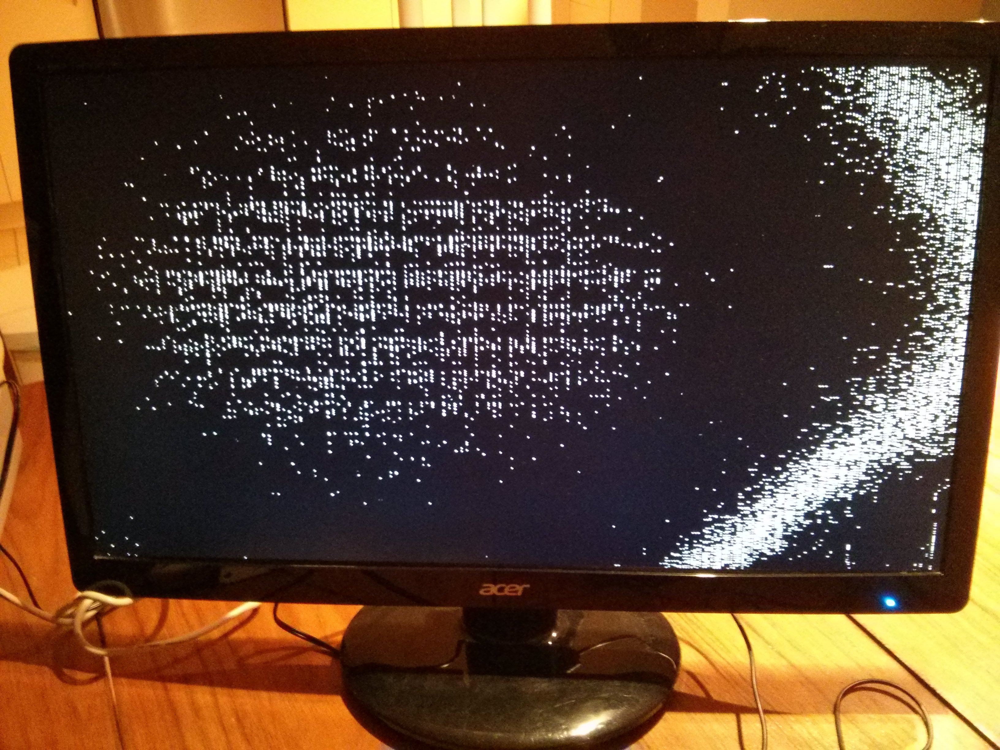
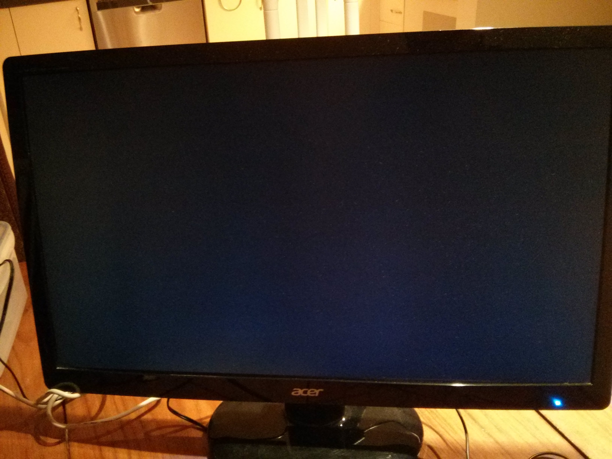

# Using the Delta Frame to Produce Object Coordinates
### Overview
The point of the delta frame is generate a position for the object in the frame. The goal of this experiment to develop two Verilog modules:

1. `measure_position.v` : Takes in the delta frame and generates an (x,y) coordinate marking the center of the object in the frame.
2. `color_position.v` : Takes in the pixels prior to the VGA controller and changes the color to red if it matches an (x,y) input.

These modules will be verified in hardware.

### Hardware Used
1.  Altera DE2 board
2.  VGA cable
3.  Acer LED monitor with a VGA port
4.  Mini CCD Digital Camera (outputs NTSC video on an RCA cable)

### Results

The two modules were integrated with relative ease. Only a few adjustments had to be made from the orignal plan:

1. The VGA position outputs are used in both modules instead of internal counters. This ensured the data processing is synchronized (aside to maybe a couple cycle delays) with the output. 
2. A threshold was added to `measure_posisiton.v` ensure there is a minimum number of pixels to detect a valid image. This makes the red target box disappear when there is nothing in the frame.
3. The delta frame was modified to fix a bug that caused the delta frame to "wrap" around the display, which messed up the tracking.

A demo of this experiment can be seen [here](https://www.youtube.com/watch?v=8xPpoj7ziko).

The moving average length was increased to 20, and it is clear that the moving average filter makes a big difference in results quality. The two images below show the delta output of the base frame with no objects in it. It is expected to be all black but with no filter, a lot of noise is present - probably due to light variations. The moving average filter does a good job dealing with this.

