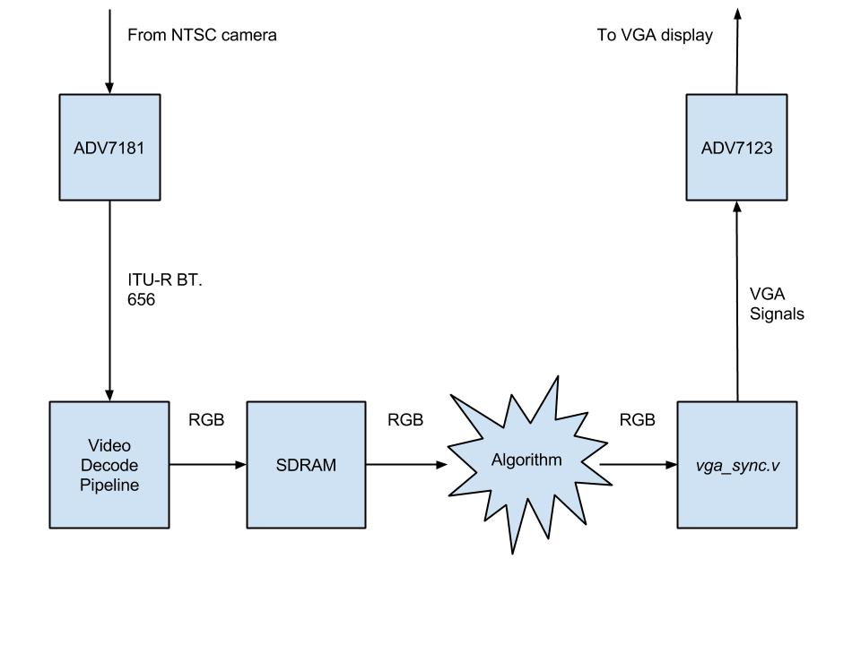

# Modifying the Video I/O Pipeline
### Overview
The video pipeline presented in the last experiment proved to work well and made sense after enough time was spent analyzing it. This pipeline will have to be modified in the future to add video processing steps to perform object tracking. If the input decoding, frame buffer, and VGA output are all decoupled from another in easy to modular blocks, algorithm integration will be much easier. While the VGA output is seperate, the SDRAM frame buffer and the video decoding are not decoupled. This experiment aimed to fix that by turning the video decoding into a seperate module from the frame buffer. Ideally, a high-level system architecture would look something like the following figure.

In the previous pipeline, the SDRAM frame buffer stored YCbCr data and has chroma upsampling and RGB conversion performed after the frame buffer. Since the object tracking algorithm is based on RGB image data, ideally these two stages would occur prior to the SDRAM frame buffer. Thus this experiment aimed to make these modifications, and then wrap the video decoding stages up into one module.

### Hardware Used

1.  Altera DE2 board
2.  VGA cable
3.  Acer LED monitor with a VGA port
4.  Mini CCD Digital Camera (outputs NTSC video on an RCA cable)

### New Architecture Results & Challenges 
Pushing the SDRAM completely after the video decoding was a success, but it came at a price of lower quality and a somewhat grayscale output. 

The new architecture is very similar to the figure above, with the module called `video_input` containing taking as input the TV decoder signals from the ADV7181 and producing 10-bit RGB data and a valid signal. Inside the `video_input` module are the three Terasic modules `ITU_656_Decoder`, `yuv422_to_yuv444` (which was modified slightly to remove the VGA output dependency), and `YCbCr2RGB`. It also contains the Altera divide megafunction used for downsampling. Now the top-level module `new_pipeline` is simply instances of the video decoding module just described, the SDRAM frame buffer, and the VGA controller.

It was also determined that the stable signal detection module, `td_detect`, and the reset delay module, `Reset_Delay`, inherited from the demo design were not needed, and everything could be reset on the same global. 

The main issue that arises from pushing the SDRAM frame buffer after the RGB converion is that now we need to store 3 10-bit RGB values instead of one 16-bit YCbCr value. This is inconvenient mostly because the SDRAM data bus is only 16-bits wide, so it would take two writes instead of one to store the RGB data. To remedy the situation without have to add extra logic and an extra flop (it would take an extra cycle to get data out on the read side), the RGB data was truncated and packed into a 16-bit sample, following the [high color](https://en.wikipedia.org/wiki/High_color#16-bit_high_color) data format. The output is still usable, but it looks grayscale and more pixelated now.