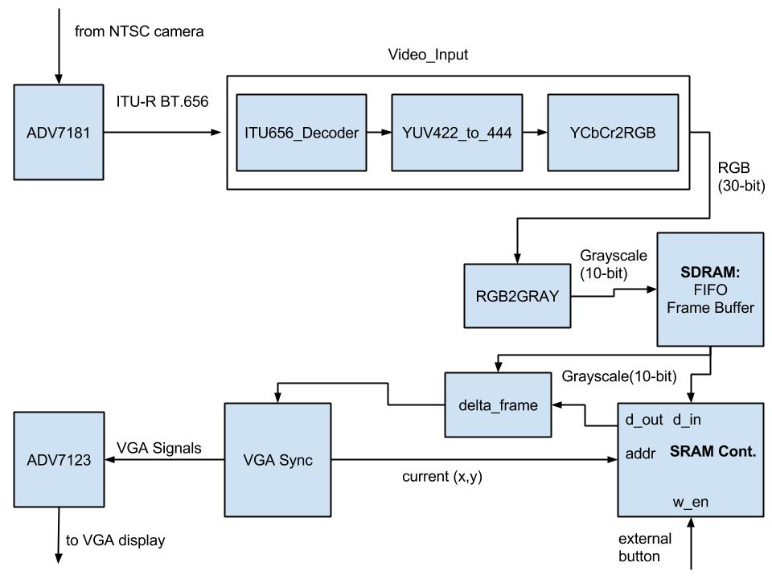
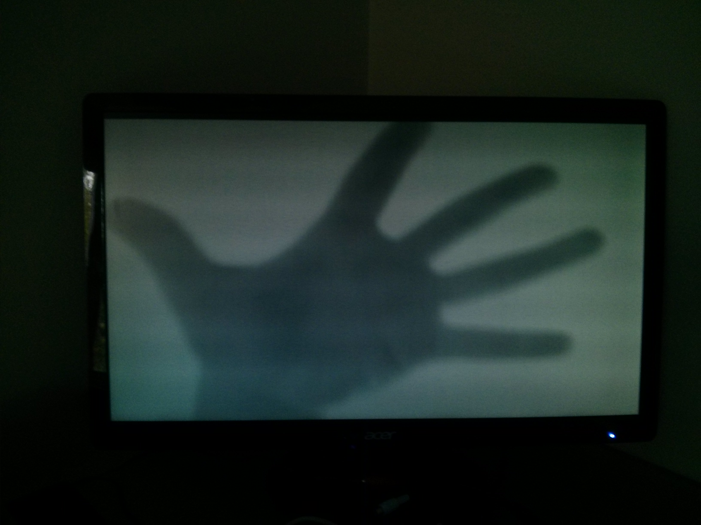
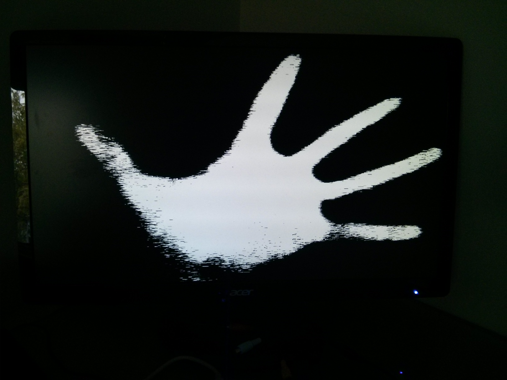

# Modifying the Video I/O Pipeline: Part 2
### Overview
A good starting point for algorithm implementation will be displaying the delta frame on the VGA display. The delta frame is simply the difference of a "base frame" and the current frame captured by the camera. If the proper assumptions are made about the base frame, it should display only the motion. The SRAM will be used to capture, and continually read out the base frame, and the RGB to grayscale allows each pixel to be represented as one number, making subtraction possible.

### Hardware Used

1.  Altera DE2 board
2.  VGA cable
3.  Acer LED monitor with a VGA port
4.  Mini CCD Digital Camera (outputs NTSC video on an RCA cable)

### Results
The new system architecture after this experiment now looks like the following figure.

Integrating the SRAM went smoother than expected. By placing the SRAM after the SDRAM frame buffer, the output data from the frame buffer could be used as input data to the SRAM. Using the VGA position for address, and an external key for writen enable was all that was necessary to get it working. To test this new functionality, the display would constantly pump out the SRAM data after write enable was pressed, this gave the effect of taking a picture from a live video stream.

Integrating the RGB to grayscale required more thought. Initially we were going to place one on each output of the SRAM and SDRAM, to constantly convert the current and base frames prior to delta frame calculation. This would require more hardware, but it would allow the output to still be displayed in color (since all data is being captured in color). After some initial issues with this (unsure what the cause was), we moved the RGB to grayscale module after the video input pipeline, and before the SDRAM frame buffer. Since the color value was being truncated to 30-bit RGB to 16-bit RGB, it already looked almost grayscale anyways, so producing grayscale video isn't that much of a setback. 

The final peice of this experiment was implementing a delta frame module in hardware. Writing this was easy, and didn't require any simulation since it is just a subtraction and absolute value. Initial testing with the module gave lots of noise though. It was decided during a meeting that we should saturate the delta frame, i.e. all values below a threshold become 0 and all values above become 1023. This would hopefully remove some noise and make post-processing easier. The threshold for saturation was set using the DE2 switches, so it could be adjusted to accomdate for varying conditions. Saturation helped, but there was still noise, probably due to small variations in background lighting (the algorithm requires constant lighting). To help combat this noise, a moving average filter of length 5 was implemented in the delta frame. This helped, and produced the results shown below.

Regular Output:

Delta Frame Output (with threshold set at b1101111)

Issues arise when the object gets too close to the camera, and when the base frame has shadows in it.
