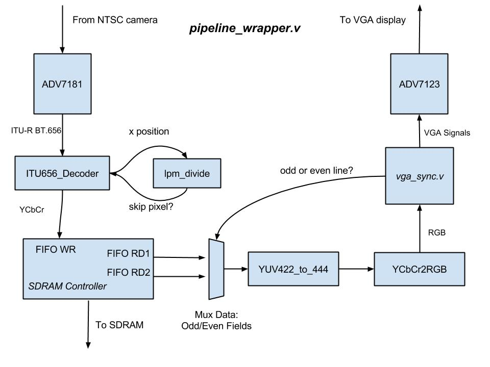

# Understanding the Video I/O Pipeline
### Overview
The Altera DE2-115 board by Terasic comes with an example design (Quartus II and Verilog files) for using the ADV7123, ADV7181, and the SDRAM to display an input video source on a VGA display. This demonstration is located in the `DE2_115_demonstrations/DE2_115_TV` directory of the system CD as mentioned in the previous experiment, and was the foundation for this experiment. The goal of this experiment was to dive into the demonstration and figure out from a system perspective how real-time video can be displayed on a computer monitor using the Cyclone IV and the DE2 periperals. 

### Hardware Used
The first step of this experiment was simply compiling and programming the Terasic demo onto the DE2 board and testing it with the following hardware.

1.  Altera DE2 board (obviously)
2.  VGA cable
3.  Acer LED monitor with a VGA port
4.  Mini CCD Digital Camera (outputs NTSC video on an RCA cable)

Running the demo design worked first time on the hardware (nice job, Terasic). Unfortunately, the code was not documented at all and didn't appear to be easily integrable into another design (not so nice job, Terasic). The code would need to be fully understood and modified in order to be used.

### Gutting the Demo Design
To start, all the audio components of the demonstration were removed, as they wouldn't be necessary in this project. This was the `AUDIO_DAC` module.

Next, the I2C configuration of the ADV7181 could be removed without impacting the quality of the output. Maybe this could be added back in later, but for now the goal is to get this as minimal as possible. This was the `I2C_AV_CONFIG` module, and the `I2C_Controller` module beneath it.

The demo design also had all the input/ouput ports for lots of other peripherals like the 7-segment display, buttons, GPIO, and so on. All of these ports and any logic involved with them was removed. The only module tied to these that was instantiated in the top-level was the `SEG7_LUT_8`. In summary, the only peripherals need for basic video I/O is the VGA, TV Decoder, Clock, Key (for reset), and the SDRAM.

Finally, the demo design had two instances of a module called `Line_Buffer` in the top-level that are instances of a shift register Altera megafunction. After the YCbCr data comes out of the SDRAM frame buffer it goes through these two modules and then into the section of code below known as the "mystery logic":
```
    assign	Tmp1	=	m4YCbCr[7:0]+mYCbCr_d[7:0];
    assign	Tmp2	=	m4YCbCr[15:8]+mYCbCr_d[15:8];
    assign	Tmp3	=	Tmp1[8:2]+m3YCbCr[7:1];
    assign	Tmp4	=	Tmp2[8:2]+m3YCbCr[15:9];
    assign	m5YCbCr	=	{Tmp4,Tmp3};
```
Where `mYCbCr_d` is the raw data from the frame buffer, and `m3YCbCr`, `m4YCbCr` the data after the shift registers. This was the one area of the demo where I still have no idea what it's purpose is and why it was necessary. Removing the two line buffers and the "mystery logic" did not produce any visibly negative effects on the output.

### Simplified Video Pipeline
After removing the previously mentioned modules and logic, doing a major syntax clean-up, and integrating and parameterizing the VGA module from the previous experiment, it became clear what was the bare minimum needed for video input/output on an FPGA. The figure below hopefully illustrates this, which shows the flow of the the Verilog module `pipeline_wrapper`. By parameterizing constants and adding comments, it is much easier to understand the purpose of each signal now.

